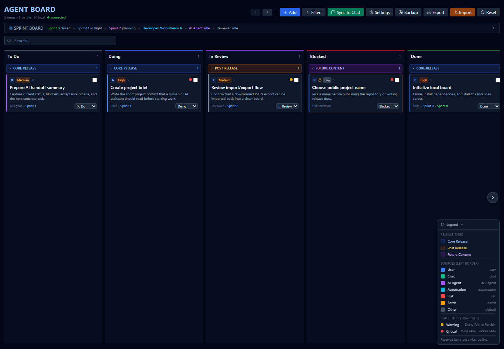

# Agent Board

[](https://github.com/Th3Sp00kyM8/agent-board/actions/workflows/ci.yml)
[](https://github.com/Th3Sp00kyM8/agent-board/releases)
[](LICENSE)

Agent Board is a local-first kanban board for coordinating human and AI project work. It runs on your machine, stores state in plain JSON, and includes a chat-friendly summary export for handoffs to assistants or teammates.

It is designed for private project planning, not as a hosted multi-user service.



## Features

- First-run template chooser for blank, demo, software, creator launch, research, and operations boards
- Start Here checklist that guides a new board through setup without separate documentation
- Focus Dashboard that immediately surfaces attention items, blockers, next work, risks, decisions, and roadmap load
- Local kanban board with To Do, Doing, In Review, Blocked, and Done columns
- Command palette with keyboard-selected, grouped, fuzzy-ranked results, recent actions, configurable local shortcut, board filters, exports, backups, settings, templates, and item jump
- Essentials-first item editor with advanced planning fields available on demand
- Undo snackbar for moves, bulk edits, deletes, reset, and template application
- Visible keyboard focus states, focus-trapped main modals, and arrow-key card navigation
- Tiered sections for Core Release, Post Release, and Future Content
- Configurable project title and visible labels for workstreams and cycles
- Sprint board for last/current/next cycle notes
- Project Map panel with grouped, shareable domain, owner, and roadmap filter presets for dependency tracing, open risks, roadmap stages, decisions, owners, and domains
- One-click "Sync to Chat" summary copied to your clipboard
- JSON export/import for full-state handoff or migration, plus copyable and downloadable markdown export presets for reviews
- Timestamped backups under `backups/`
- File-backed state that is easy to inspect, version separately, or restore

## Quick Start

```powershell
git clone https://github.com/Th3Sp00kyM8/agent-board.git
cd agent-board
npm install
npm run dev
```

The dev command starts:

- Vite UI: `http://localhost:5173`
- Express API: `http://localhost:5174`

If the browser does not open automatically, navigate to `http://localhost:5173`.

To run beside another local app, override ports before starting:

```powershell
$env:AGENT_BOARD_UI_PORT=5273
$env:AGENT_BOARD_API_PORT=5274
npm run dev
```

## Use As A Template

On GitHub, click `Use this template` to create a new project board from Agent Board without linking your new repository history to this repo. Use a fork only when you want to contribute changes back here.

See [Using Agent Board As A Template](docs/TEMPLATE_USE.md) for the recommended paths.

## First Run

On first run, the server creates local files from the committed examples:

- `config.example.json` -> `config.json`
- `sample.state.json` -> `state.json`

The generated `config.json`, `state.json`, and `backups/` folder are ignored by Git. They are your local working data.

When the board is blank or still on the demo sample, Agent Board opens a template chooser so new users can start from a blank board, demo board, software project, creator launch, research project, or operations tracker. You can reopen it later from `Templates` in the header.

The Focus Dashboard also includes a Start Here checklist until the board has a starting point, real work, an owner/domain, and at least one item in active work. This keeps onboarding inside the tool instead of forcing new users to read the README first.

## Local Files

Committed starter files:

- `sample.state.json` - fake demo board used for first-run bootstrap
- `config.example.json` - starter project-name and label config

Local ignored files:

- `state.json` - your real board data
- `config.json` - your local project config
- `backups/` - timestamped backup files

This separation keeps the app reusable while keeping real project data out of Git.

## Customizing For Your Project

Click `Settings` in the header to edit the local project title, work item label, cycle label, import field aliases, and custom markdown export presets. Settings includes import alias presets for Default, GitHub Issues, Jira, and Linear-style schemas, plus a form-based custom export preset builder for adding, editing, deleting, copying, and downloading reusable markdown templates. Settings are saved to ignored local `config.json` so forks can keep reusable defaults in Git while each user keeps private local wording on their machine.

You can also edit `config.json` directly after first run:

```json
{
  "projectName": "Website Redesign Board",
  "labels": {
    "workstream": "Area",
    "cycle": "Milestone"
  },
  "importFieldAliases": {
    "owner": ["assignee", "lead"],
    "dependencies": ["dependsOn", "blockedBy"],
    "riskLevel": ["risk"]
  },
  "exportPresets": [
    {
      "id": "custom-brief",
      "label": "Custom Brief",
      "detail": "Editable template",
      "template": "**{{project}} Brief** - {{date}}\n\n**Next up:**\n{{nextUp}}"
    }
  ]
}
```

Refresh the browser after direct file edits. `projectName` changes the app title. `labels.workstream` and `labels.cycle` update visible UI labels and the Sync to Chat summary. Custom markdown export templates support simple tokens such as `{{project}}`, `{{date}}`, `{{total}}`, `{{blocked}}`, `{{nextUp}}`, `{{risks}}`, and `{{roadmapCounts}}`.

For deeper changes, edit `src/App.jsx` constants such as columns, tiers, source legend, project domains, roadmap stages, risk levels, and decision states. Those are intentionally small and near the top of the file.

## Resetting The Demo Data

To return local data to the committed examples:

```powershell
npm run reset:sample
```

This backs up existing `state.json` and `config.json` into `backups/`, then restores them from `sample.state.json` and `config.example.json`.

## Backups

Click `Backup` in the header to create a timestamped copy of `state.json` in `backups/`. Both `state.json` and `backups/` are ignored by Git.

## Import And Export

Use `Export` to download a full JSON copy of the board. Exports include `app`, `schemaVersion`, and `version` metadata so future forks can identify compatible board files. The export modal also includes markdown export presets for a chat sync, risk review, decision log, roadmap summary, stakeholder summary, weekly update, release review, support review, audit prep, planning summary, or custom template. Each markdown preset can be copied or downloaded as a `.md` file.

Use `Import` to preview and replace the current local board with a compatible JSON file. The import preview compares current and incoming item counts, column distribution, risks, decisions, dependencies, metadata, warnings, fix suggestions, sample incoming items, and a replacement diff before replacement. The diff highlights added, changed, and removed paths, including field-level changes for matching paths, so the replacement is easier to review. Import dry-run validation blocks structurally invalid imports, including missing required item identifiers or titles, and flags duplicate ids, duplicate paths, unknown columns, unknown release tiers, missing owners, unknown domains, unknown roadmap stages, and custom fields before you replace local data. Import field mapping recognizes common custom schema names such as `status`, `priority`, `assignee`, `dependsOn`, and `risk`, then reports the mapped fields in the preview. If alias-mapped fields still contain unknown columns or release tiers, the warning shows the expected values and the preview suggests how to fix the data. Simple status, release-tier, owner, domain, and roadmap-stage mismatches show a repair preview with before/after values and can be repaired from the preview before replacement. You can edit import field aliases in `Settings`. Agent Board also imports shared Project Map view bundles and custom export preset bundles without replacing the board. Agent Board still accepts older item-array exports, adds current metadata on save, and warns before importing unknown newer schemas. Create a backup first if the current board matters.

## Templates

Use `Templates` to replace the current board with a practical starter workflow. Templates are intentionally generic and local-only: applying one writes to your ignored `state.json`, not to the committed sample. Create a backup first if the current board matters.

## Editing Work

Click `Add work` or edit any card to open the essentials-first item editor. The default view asks for the fields most people need immediately: work item id, title, description, owner, domain, status, priority, and size. Use `Advanced planning fields` for release tier, source, cycle assignment, risk, roadmap, decision state, dependencies, notes, and reserved status.

Most risky changes show a short-lived undo snackbar, including card moves, bulk edits, deletes, resets, and template application.

## Keyboard Workflow

Open the command palette with `Ctrl+K` on Windows/Linux or `Cmd+K` on macOS. Use it to add work, open templates, show filters, focus blocked work, copy a chat sync, export, import, create a backup, open settings, reset after confirmation, or jump directly to a work item. Results are grouped by purpose and fuzzy-ranked so partial command names still find the right action. Use ArrowUp, ArrowDown, Home, End, and Enter to select and run results from the search field. Recent commands appear at the top of the palette.

The command-palette shortcut can be changed or turned off in `Settings`. This preference is saved locally in your browser and does not change project files.

Work cards are keyboard-operable: press `Enter` to open the focused card, `Space` to select it, arrow keys to move focus between visible cards and columns, and `Alt+Arrow Left` / `Alt+Arrow Right` to move the card between board columns. The command palette, template chooser, settings modal, detail modal, and item editor keep focus inside the active dialog until closed.

## Focus Dashboard

The first screen is designed to answer the questions a project owner usually has first: what needs attention, what is blocked, what is ready to pick up, what risks are open, what decisions are pending, and what is on the roadmap. Each dashboard list item opens the underlying card, so the summary stays connected to the board.

## Project Map

The Project Map is a compact planning layer above the board. Each item can carry a domain, owner, dependency list, risk level, roadmap stage, and decision state. Dependencies can point to another item by `id`, visible path such as `A`, or exact title. The panel then highlights unfinished dependency blockers, missing links, open risks, roadmap distribution, and pending decisions. Use the domain, owner, and roadmap filters to narrow the map counts without changing the board filters, then save common map views as named local presets. Saved map views can be grouped, renamed, reordered, deleted, copied, downloaded, or imported as shared view bundles.

These fields are intentionally generic so forks can rename them for software work, content planning, operations, research, or other project-management workflows without needing private data in the upstream template.

## Chat Handoffs

Use `Sync to Chat` to copy a compact status summary. It includes counts, cycle notes, active work, blocked work, recent completions, dependency blockers, open risks, decisions, roadmap stages, domains, and top unblocked tasks.

For a complete handoff, use `Export` and share the downloaded JSON file.

## Security Model

Agent Board is an unauthenticated localhost tool. Do not expose ports `5173` or `5174` to a network you do not trust.

## Project Docs

- [Using Agent Board As A Template](docs/TEMPLATE_USE.md)
- [Adapting Agent Board For Your Project](docs/ADAPTING.md)
- [Contributing](CONTRIBUTING.md)
- [Security Policy](SECURITY.md)
- [Support](SUPPORT.md)
- [Code of Conduct](CODE_OF_CONDUCT.md)
- [Roadmap](docs/ROADMAP.md)
- [Changelog](CHANGELOG.md)
- [Release Checklist](docs/RELEASE.md)
- [Publishing Guide](docs/PUBLISHING.md)

## Development

```powershell
npm run verify
npm run build
npm run release:check
npm run smoke:fresh
```

The app is intentionally simple: React + Vite frontend, Express backend, JSON files on disk.

GitHub Actions runs `npm ci`, `npm run verify`, `npm run build`, and `npm audit --audit-level=moderate` on pushes and pull requests.
